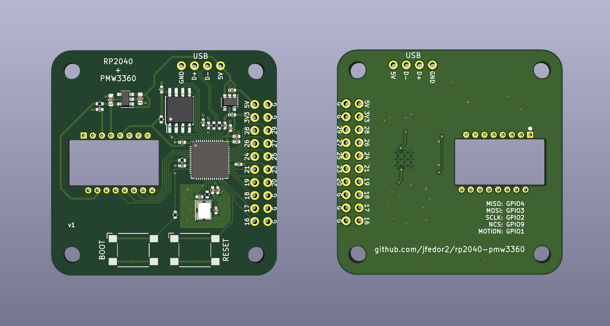

# RP2040+PMW3360

This repository contains design files and code for a PCB carrying Raspberry Pi's RP2040 chip and the PixArt PMW3360 optical mouse sensor. They can be used for rapid prototyping of USB mice and trackballs.

The files in the [fabrication](fabrication) folder can be used to order this board from JLCPCB with SMT assembly. The board you get includes everything except the sensor. If some of the specific components are out of stock, try to find an equivalent with the same package and parameters.

The sensor chip should be soldered on the bottom side (the opposite side from all the other components). The dot marks pin 1. The optic goes on the top side.

If you're looking for a convenient way of mounting mouse button switches in a case, perhaps [this repository](https://github.com/jfedor2/mouse-switch-mount-pcb) will be of use.

Examples of devices made using this board:

* [Trackball 7](https://www.prusaprinters.org/prints/83631-trackball-7)
* [Trackball 8](https://www.prusaprinters.org/prints/84148-trackball-8)
* [Spherical trackball](https://www.prusaprinters.org/prints/85053-spherical-trackball)
* [Two-ball trackball](https://github.com/jfedor2/two-ball-trackball)

